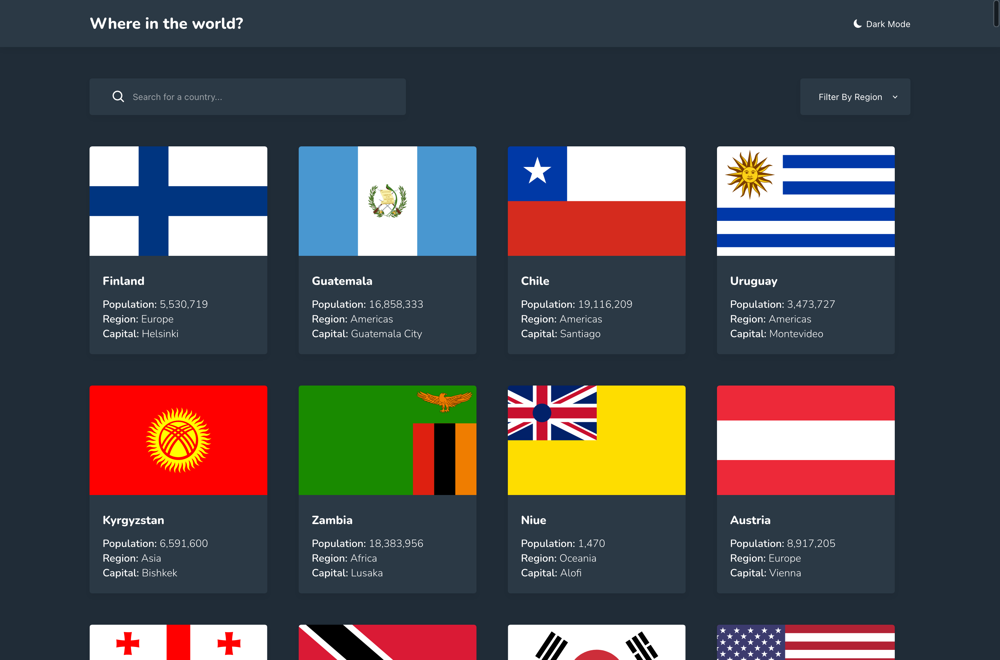
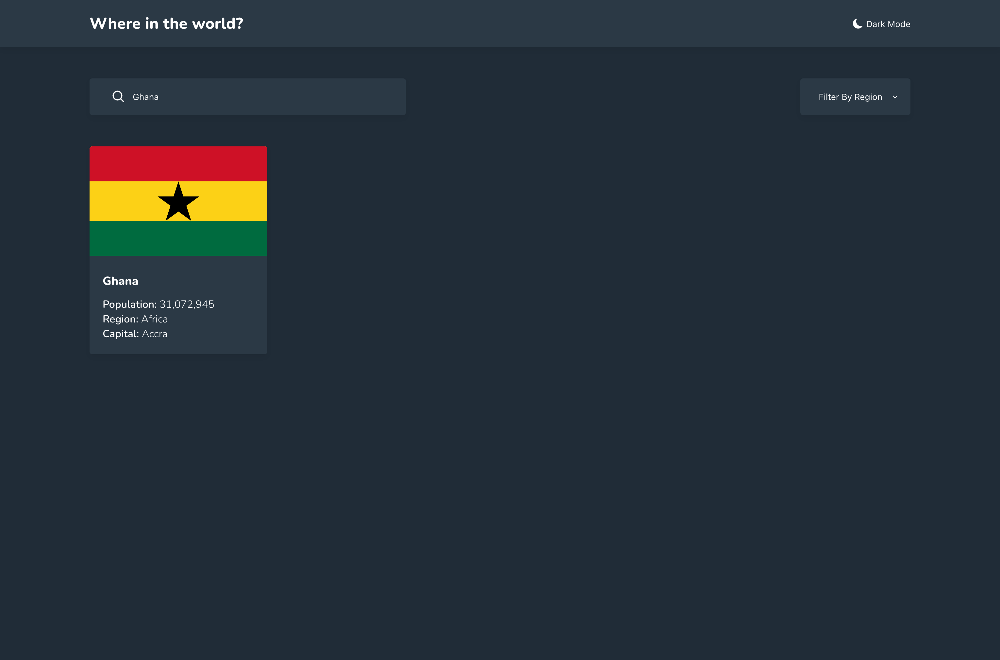
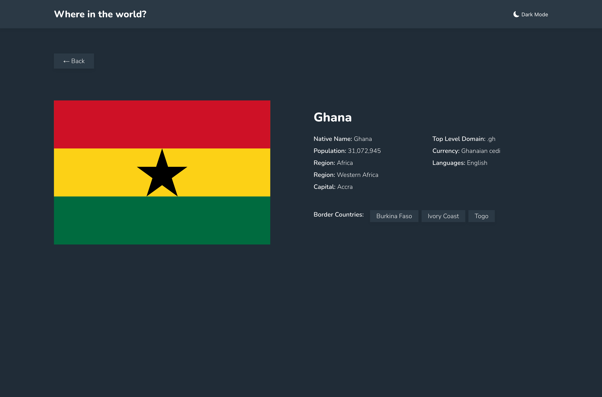

# Frontend Mentor - REST Countries API with color theme switcher solution

This is a solution to
the [REST Countries API with color theme switcher challenge on Frontend Mentor](https://www.frontendmentor.io/challenges/rest-countries-api-with-color-theme-switcher-5cacc469fec04111f7b848ca)
. Frontend Mentor challenges help you improve your coding skills by building realistic projects.

## Table of contents

- [Overview](#overview)
    - [The challenge](#the-challenge)
    - [Screenshot](#screenshot)
    - [Links](#links)
- [My process](#my-process)
    - [Built with](#built-with)
    - [What I learned](#what-i-learned)
    - [Continued development](#continued-development)
    - [Useful resources](#useful-resources)
- [Author](#author)
- [Acknowledgments](#acknowledgments)

## Overview

### The challenge

Users should be able to:

- See all countries from the API on the homepage
- Search for a country using an `input` field
- Filter countries by region
- Click on a country to see more detailed information on a separate page
- Click through to the border countries on the detail page
- Toggle the color scheme between light and dark mode *(optional)*

### Screenshot

### Links

- Live Site URL: [Countries App Challenge](https://countries.ammielyawson.com)

## My process

1. UI Conversion:
    - NavBar
    - ListView
    - CountryDetailView
2. Integration:
    - ListView:
        - All countries endpoint
        - Filter countries by region endpoint
        - Search countries by name
    - DetailView:
        - Search country by full name

### Built with

- Semantic HTML5 markup
- CSS custom properties
- Flexbox
- CSS Grid
- Mobile-first workflow
- [Vue](https://vuejs.org/) - JS library

### What I learned

I used this app to revise view JS concepts. ie:

- Routing with Vue Router
- Global State Mgt with Vuex
- API Integration with axios

### Useful resources

- [Vue Docs](https://www.vuejs.org) - The best guide on Vuejs.
- [Vue Router Docs](https://router.vuejs.org/) - Guide for routing with Vue router.
- [Vuex Docs](https://vuex.vuejs.org/) - Guide for global state mgt with Vuex.

## Author

- Website - [Ammiel Yawson](https://www.ammielyawson.com)
- Frontend Mentor - [@AmmDuncan](https://www.frontendmentor.io/profile/AmmDuncan)
- Twitter - [@ammduncan](https://www.twitter.com/ammduncan)
